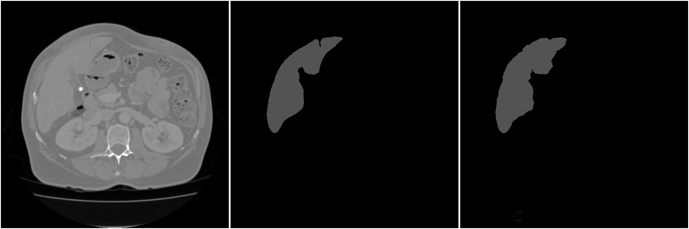
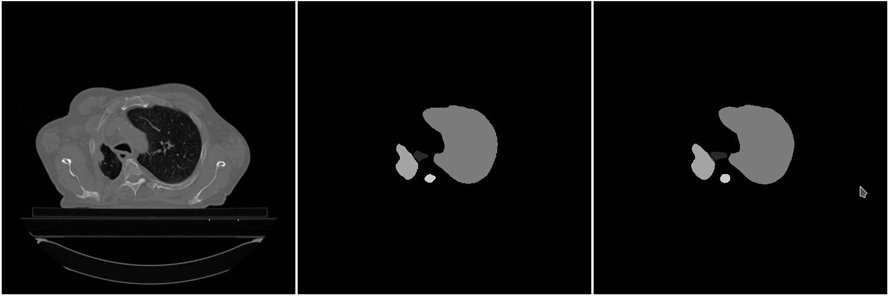

# outmark
Experiments in deep learning-based medical image segmentation.

*left -- computed tomography image, center -- segmentation of liver by an experienced radiologist, right -- segmentation by our convolutional neural network*

*left -- computed tomography image, center -- segmentation of esophagus, spinal cord, left lung, and right lung by an experienced radiologist, right -- segmentation by our convolutional neural network*
